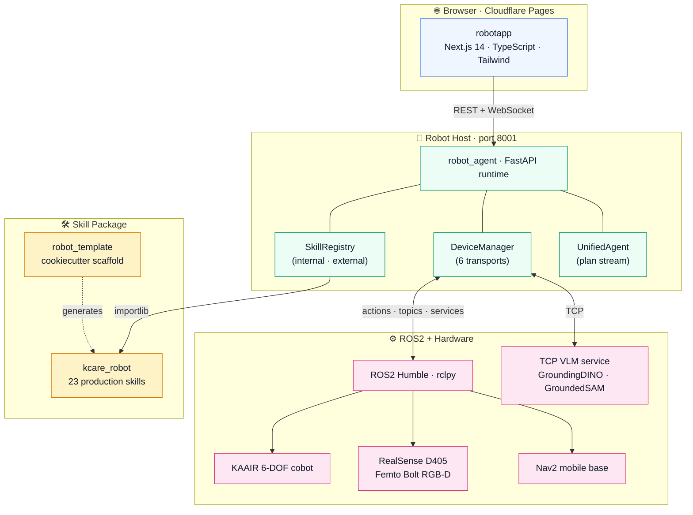
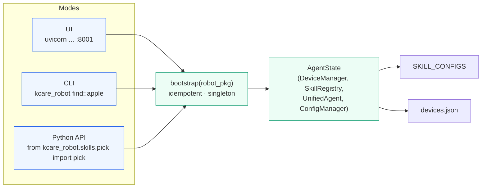
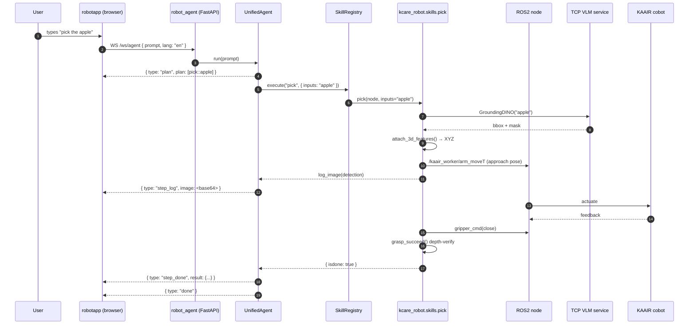

import { Aside } from '@astrojs/starlight/components';

The system is intentionally **layered, not monolithic**. Each layer can be
swapped — a new dashboard, a new robot, a new perception backend — without
touching the others.

## The four layers



## Why this composition

- **Browser → FastAPI over WebSocket + REST.** Anyone can drive a robot from
  anywhere with internet access. The frontend is static — no server runtime to
  manage.
- **FastAPI → ROS2 via one shared node.** `DeviceManager` lazy-initialises a
  single `CustomNode` with **4 callback groups**, spun in a daemon thread.
  Discovers everything, spins once, cleans up in FastAPI's `lifespan`.
- **Skills live in a separate package.** `robot_agent` ships zero
  hardware-specific code. The contract is one dict:
  ```python
  SKILL_CONFIGS: dict[str, tuple[module_path, func_name]]
  ```
- **Vision is plug-in.** Heavy models (GroundingDINO, SAM, mask2grasps) live
  on a GPU host and are reached over TCP. Light skills live on the robot. The
  registry treats them identically.

## Three execution modes from one core

```python
# robot_agent/runtime.py
def bootstrap(robot_pkg: str, *, node_name: str | None = None) -> AgentState:
    """Idempotent. Builds the singleton AgentState exactly once per process."""
```



CLI auto-suffixes the rclpy node name with `_<pid>` so it won't collide with
a running UI on the same host. (A single physical robot still accepts
commands from any caller — operators must coordinate.)

## End-to-end request — "pick the apple"



The whole flow is **one WebSocket per request**. The frontend's
[`PlanPanel.tsx`](/robotapp/stack/robotapp/#components) renders each event as
it arrives — step status icons, inline detection frames, expandable JSON
results.

## Layered responsibilities, in one table

| Layer | Owns | Doesn't own |
|---|---|---|
| **robotapp** | UI state, WebSocket decode, depth colormap, multi-robot registry | Skills, ROS, hardware |
| **robot_agent** | Skill dispatch, device transport, plan execution, streaming, persistence | Skill bodies, hardware drivers |
| **kcare_robot / template** | Skill implementations, ROS message shapes, calibration | Transport, registry, UI |
| **ROS2 + drivers** | Hardware I/O, low-level control loops, sensor publishing | Application logic |

## Persistence model

Every stateful artefact uses the same atomic-write pattern in
`robot_agent/core/*`:

```
write(.tmp)  →  rotate(existing → .bak)  →  rename(.tmp → final)
```

Files:
- `skills.json`     — SkillRegistry CRUD
- `connects.json`   — DeviceManager device registry
- `buttons.json`    — quick-action shortcuts
- `skill_configs.json` — per-skill overrides

No DB, no migrations. Restart-safe by construction.

<Aside type="tip">
Want to see the streaming protocol in detail?
**[Read the streaming deep dive →](/robotapp/deep-dive/streaming/)**
</Aside>
