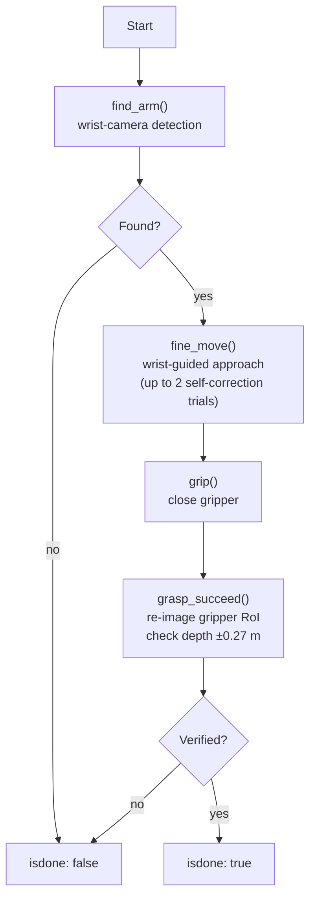

import { Aside } from '@astrojs/starlight/components';

The perception layer of [`kcare_robot`](/robotapp/stack/kcare-robot/) takes a
text query like *"apple"* and returns **a 6-DOF grasp pose in the robot's
base frame**, ready for the arm.

## The pipeline

```mermaid
flowchart LR
  P["text prompt<br/>'apple'"] --> F["fetch RGB-D<br/>(D405 wrist or<br/>Femto Bolt head)"]
  F --> D["GroundingDINO<br/>(open-vocab bbox)"]
  D --> S["GroundedSAM<br/>(per-instance mask)"]
  S --> A["attach_3d_features()<br/>· per-cluster normals<br/>· min/med/max depth<br/>· XYZ centroid<br/>· lying-object flag"]
  A --> G["mask2grasps<br/>(2D pixel endpoints)"]
  G --> L["Lift to 6-DOF pose<br/>(depth + intrinsics +<br/>wrist offset)"]
  L --> C["Head2Base calibration<br/>(camera frame → base frame)"]
  C --> R["6-DOF grasp pose<br/>{xyz, rpy}"]

  classDef io fill:#fef3c7,stroke:#d97706,color:#0f172a;
  classDef mod fill:#eff6ff,stroke:#2563eb,color:#0f172a;
  classDef out fill:#ecfdf5,stroke:#059669,color:#0f172a;
  class P,F io;
  class D,S,A,G,L,C mod;
  class R out;
```



## Why open-vocabulary?

A classic robot perception stack ships a fixed set of trained classes. The
moment the user says *"the red mug"*, you're stuck.

This stack runs **GroundingDINO** for the detection step — a vision-language
model that accepts free-text and returns bounding boxes. The skill author
writes the query *at call time*:

```python
ret = find(inputs='apple')               # works
ret = find(inputs='red mug on the table') # also works
ret = find(inputs='the can')              # also works
```

The same goes for **GroundedSAM** (segmentation) and **mask2grasps** (grasp
proposal) — none of them are trained on a fixed class set.

## Why TCP, not in-process?

The vision models are heavy (GroundingDINO + SAM ≈ several GB of weights and
a GPU). The robot's onboard compute is not.

`robot_agent`'s `DeviceManager` supports **TCP** as a first-class device
transport. The robot opens a long-lived TCP connection to a GPU host
(192.168.1.11:8805) and pipes detection/segmentation queries over it. Same
behaviour over the same API:

```python
ret = node.agents['vlms'].send({
    'detector': 'grounding_dino',
    'image':    rgb_jpeg_bytes,
    'caption':  'apple',
})
```

The `vlms` service publishes `GroundingDINO`, `GroundedSAM`, and
`mask2grasps`. Adding a new detector is one entry on the GPU side and one
device registration on the robot side.

## 3D feature extraction — what `attach_3d_features` does

Source: [`kcare_robot/skills/recognition.py`](https://github.com/mtbui2010/kcare_robot/blob/main/kcare_robot/skills/recognition.py), 415 lines.

For each detected mask:

1. **Cluster the masked depth pixels** (handles partial-occlusion / noise).
2. **Compute per-cluster normals** via weighted depth gradient.
3. **Aggregate depth statistics** (`min`, `median`, `max`) per cluster.
4. **Lift to 3D**: `Ixy2xyz(u, v, depth, fx, fy, ppx, ppy)` — straightforward
   inverse projection.
5. **Classify pose** — *lying* vs *standing* from normal-vector dispersion;
   estimate handle position via mass-center percentages.

The output is a dict per detection:

```python
{
  'caption': 'apple',
  'score':   0.78,
  'bbox':    [u0, v0, u1, v1],
  'mask':    <bool array>,
  'xyz':     [0.42, 0.13, 0.88],       # base frame
  'normal':  [0.01, -0.03, 0.99],       # in camera frame
  'depth':   { 'min': 0.41, 'med': 0.44, 'max': 0.48 },
  'lying':   False,
}
```

## Grasp pose — from pixels to 6-DOF

`mask2grasps` returns the grasp as **two 2D pixel endpoints** (the gripper's
two-finger axis). The skill lifts them with three pieces of geometry:

1. **Depth at the midpoint** → grasp Z
2. **Endpoints + depth** → grasp roll (rotation around tool axis)
3. **Wrist-offset transform** → final tool-frame pose

```python
# pseudocode of mask2grasps lift
mid = (p1 + p2) / 2
z   = depth[mid]
xyz = Ixy2xyz(mid.u, mid.v, z, fx, fy, ppx, ppy)
rpy = pixel_axis_to_rpy(p1, p2, depth_gradient)
pose_camera = (xyz, rpy)
pose_tool   = wrist_offset @ pose_camera
```

Then the **head-to-base calibration** transforms it into the base frame the
arm can plan to.

## Head-to-base calibration

`skills/calibrattion.py` ships a `Head2BaseCalibration` class with:

- intrinsic camera parameters (fx, fy, ppx, ppy) per stream
- a 4×4 link-to-base transform
- a 4×4 base-to-lift transform (the lift moves the camera vertically)
- per-mode (front / left / right) error-linear corrections — tiny rotations
  that compensate for the head's mechanical play

This is what makes *"the apple your wrist camera sees"* turn into *"an XYZ in
the base frame the arm can actually plan a trajectory to."* Skipping it
costs you ~3 cm of error at table distance — enough to miss every grasp.

## Closed-loop pick with self-correction

`skills/pick.py` (422 lines) doesn't just snapshot-and-go. The full pick is:



`fine_move()` is the closed-loop step — the wrist camera images the object
again at close range and the arm corrects laterally. **Two trials** are
allowed before the skill gives up; in practice the first trial succeeds
~90 % of the time on graspable everyday objects.

## Parallel actuator coordination

Picks aren't sequential — the arm, lift, and head move simultaneously:

```python
run_parallel_check([
    ('lift',  {'height': 0.4}),
    ('movej', {'joints': ARM_PRE_PICK}),
    ('moveh', {'rz': -30, 'ry': 20}),
])
```

`run_parallel_check()` (from `pyconnect`) fires three ROS actions in
parallel and waits for all to converge. Sequential ≈ 7 s; parallel ≈ 3 s.

<Aside type="tip">
Every skill in this pipeline returns the planner-readable contract
`{'isdone': bool, 'msg': str, ...}` — that's why the LLM planner can chain
them without bespoke glue per skill.
</Aside>
