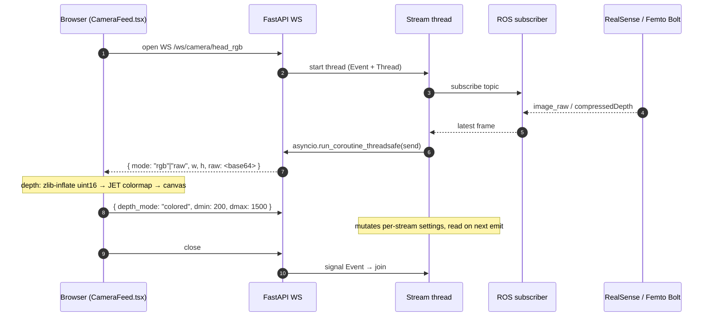
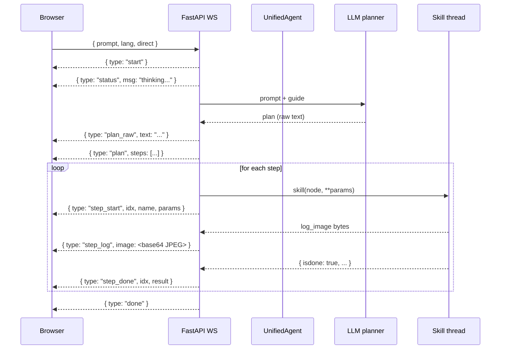

import { Aside, Tabs, TabItem } from '@astrojs/starlight/components';

Two WebSocket endpoints carry the real-time surface of the system:

| Endpoint | Direction | Carries |
|---|---|---|
| `WS /ws/camera/{connect_id}` | bidirectional | live RGB-D frames + per-stream depth settings |
| `WS /ws/agent` | server → client | task plan + step lifecycle events |

## Camera stream — `/ws/camera/{id}`

Source: [`robot_agent/api/camera.py`](https://github.com/mtbui2010/robot_agent/blob/main/robot_agent/api/camera.py).
~250 lines, the file worth opening.

### Frame lifecycle



### Why two depth modes?

| Mode | Wire format | Use case |
|---|---|---|
| `colored` | TURBO-colormap JPEG | dashboard, demos — small, pretty, but lossy |
| `raw` | zlib(uint16) | pixel-accurate mm hover, frame analysis, RoIs |

The backend auto-ranges depth via 2nd/98th percentile clipping so the
colormap stays useful regardless of scene depth.

### Polymorphic frame handling

The same endpoint accepts:

- ROS `sensor_msgs/Image` — `16uc1`, `32fc1` encodings
- ROS `sensor_msgs/CompressedImage` — with or without the 12-byte
  `compressedDepth` header
- raw numpy arrays (for WebRTC ingest paths)
- dicts of `{rgb, depth}` (for skills emitting `log_image`)

`_encode_frame()` in `camera.py` is the funnel.

## Plan stream — `/ws/agent`

The agent endpoint accepts one JSON message:

```json
{
  "prompt": "pick the apple",
  "lang":   "en",
  "direct": false
}
```

…and emits a typed event stream:



### Event types

| Type | When | Payload |
|---|---|---|
| `start` | WS opened | `{}` |
| `status` | mid-planning chatter | `{ msg }` |
| `translated` | non-EN prompt → EN | `{ original, translated }` |
| `plan_raw` | LLM raw output | `{ text }` |
| `plan` | parsed plan | `{ steps: [{name, params}, ...] }` |
| `step_start` | a step begins | `{ idx, name, params }` |
| `step_log` | mid-skill log image | `{ idx, image }` |
| `step_done` | a step ends | `{ idx, result }` |
| `done` | plan complete | `{}` |
| `error` | any failure | `{ msg, traceback? }` |

### Why a typed event stream instead of polling?

- **Low latency**: events are pushed as they happen, no fixed tick.
- **Cheap rendering**: the browser only invalidates the affected step row.
- **No state drift**: the server is authoritative; the client reflects.

## Bridging sync and async

The hardest part of building the streaming layer is that **ROS callbacks
fire on background threads** while **FastAPI WebSocket sends are async**.
`robot_agent` handles this with one idiom, used in both camera and agent:

```python
# inside the background skill / stream thread
asyncio.run_coroutine_threadsafe(
    websocket.send_json(event),
    main_loop                       # captured at WS-open time
)
```

This is the bridge between the rclpy executor's thread pool and the FastAPI
event loop. No `asyncio.run_in_executor` ping-pong, no manual queue, no
lost frames.

## JSON serialisation — the corner everyone hits

You can't `json.dumps` a numpy array. You also can't `json.dumps` a PIL
Image, an `np.float32(NaN)`, or a bytes buffer. `robot_agent` solves this
once, in two places:

- **`NumpyJSONResponse`** ([`app_factory.py`](https://github.com/mtbui2010/robot_agent/blob/main/robot_agent/app_factory.py))
  — custom FastAPI response class that handles `.item()`, `.tolist()`, and
  bytes→UTF8 for every REST endpoint
- **`_serialize_result()`** ([`core/unified_agent.py`](https://github.com/mtbui2010/robot_agent/blob/main/robot_agent/core/unified_agent.py))
  — flattens skill return values for the WebSocket stream: scalars,
  NaN/Inf, PIL Images, oversized arrays all become JSON-safe

<Aside type="note">
Together these mean skills can `return {'isdone': True, 'object_xyz':
np.array([0.42, 0.13, 0.88])}` and it works — both via REST and via WS,
with zero per-skill boilerplate.
</Aside>
